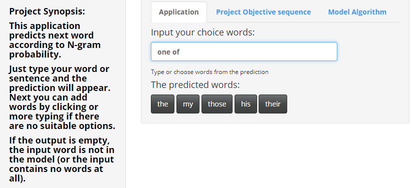

```{r setup, include=FALSE}
knitr::opts_chunk$set(echo = FALSE)
```

## Problem to solve

The main function of this app is next word (or words) prediction. Prediction must be based on user input.

The most common application of this algorithm in real life is search engine. A little less popular are chat-bots and grammar apps. This app is based on text corpus made from some pre-crawled data from twitter, news and blogs ([link to the data zip-archive](https://d396qusza40orc.cloudfront.net/dsscapstone/dataset/Coursera-SwiftKey.zip)). Output can look not very relevant, but this is just a model restriction. More words and computing power will give more precise output.


## Data used

- The English locale of dataset originally consisted of 3336695 lines.
- A sample of 3000 corpus items was randomly picked.
- Data was cleaned from punctuation, numbers, profanity words and special symbols.
- Then was a stage of tokenization and construction of N-grams (up to sixgrams).
- And serialized. Speed is important (used Rda files).


## Algorithm

The app takes user input, transforms it to lowercase, removes numbers and punctuation, then compares it with sample N-grams, choosing the most similar word. As an example, the input words **the first** will have 5 predicted words - **time, and, half, of, quarter**. There are 2 words, so the app searches through trigrams. If there are no output (no prediction), it throws away the first word and continue searching in bigrams section. And do this until it gets the output. If there are no suitable prediction at all (for example, the word **goose** has no), the output is left blank.

## The result

```{r, echo=FALSE}
   
```

- My app is available at shinyapps.io - [https://suharkov.shinyapps.io/Prediction/](https://suharkov.shinyapps.io/Prediction/)
- Source files are on github - [https://github.com/RedMedVed/jhdscapstone/](https://github.com/RedMedVed/jhdscapstone/tree/main/Prediction)
